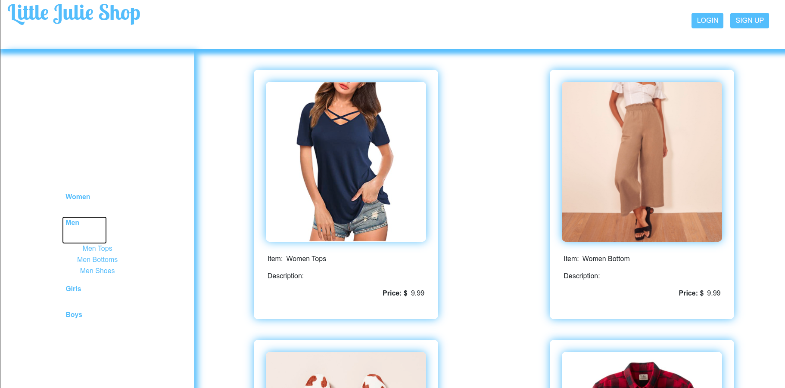

# REACT & REDUX  Little-Julie-Shop-Frontend
> Little Shop app using React, Redux and [Little-Julie-Shop-Backend](https://github.com/RailonA/Little-Julie-Shop-Backend);

## Watch the Live Version

[Live Demo : Little Julie Shop](https://littlejulieshop.herokuapp.com/)





### Built with
- JavaScript ES6
- NodeJS
- React
- React-Redux
- react-dom
- react-router-dom
- Axios
- Enzyme
- Webpack
- Buildpack
- Heroku
- Jest

### Features
- Viewing the list of services
- Viewing a user's details(info, appointment made)
- Making appointment for a service
- Login / Logout / Signup
- Modal messages of success/failure

## Getting Started

In order to run locally this project type the following commands over the terminal in Linux or Mac or the Windows cmd console:

```s
$ git clone git@github.com:RailonA/Little-Julie-Shop-Frontend.git
$ cd Little-Julie-Shop-Frontend
$ npm install
$ npm start

```

Open `http://localhost:3000` to view running project in the browser.

## Author

👤 **Railon Acosta**

- GitHub: [@railonA](https://github.com/RailonA)
- Linkedin: [@railonAcosta](https://www.linkedin.com/in/railon-acosta-81265180/)
- Twitter: [@railonAcosta](https://twitter.com/RailonAcosta)


## 🤝 Contributing

Contributions, issues, and feature requests are welcome!

Feel free to check the [issues page](https://github.com/RailonA/Little-Julie-Shop-Frontend/issues).

## Show your support

Give a ⭐️ if you like this project!

## 📝 License

This project is [MIT](https://opensource.org/licenses/MIT) licensed.